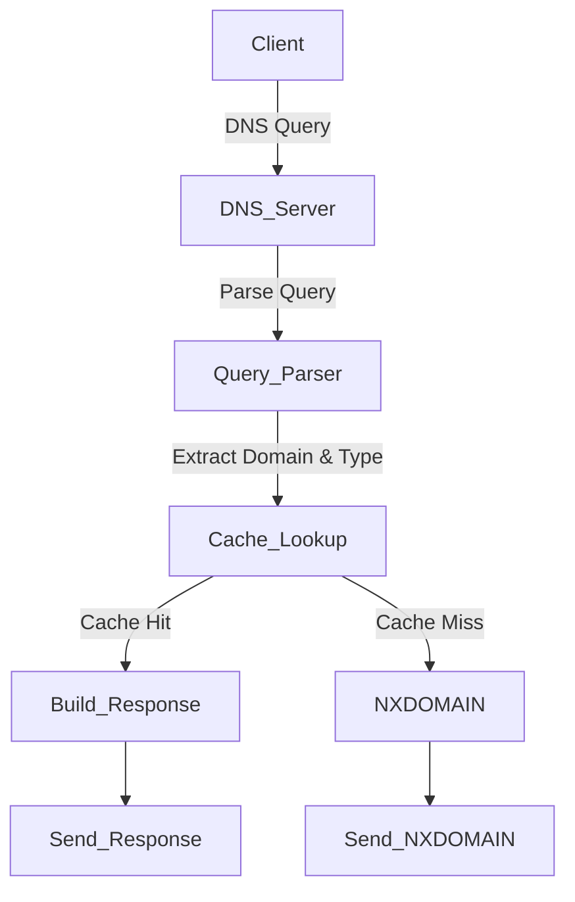

# **DNS Discovery Service**

## **📌 Overview**
The **DNS Discovery Service** is a high-performance, in-memory DNS server designed for **service discovery** within distributed systems. It enables applications to dynamically resolve service connection details (e.g., database endpoints, feature toggles, and messaging brokers) through DNS queries.

This eliminates hardcoded connection strings in applications, allowing seamless updates without redeployment.

## **🚀 Features**
- **Fast, In-Memory DNS Caching**: Optimized for low-latency responses with TTL-based eviction.
- **Support for A, AAAA, and TXT Records**: Retrieves IP addresses and configuration details dynamically.
- **Graceful Shutdown & Signal Handling**: Ensures clean shutdown and avoids resource leaks.
- **Production-Ready Logging**: Uses structured logging for observability and debugging.
- **Optimized Memory Management**: Implements `sync.Pool` for efficient memory reuse.

---

## **🖥️ Request Flow**


### **🔧 How to Load Data into Cache**
Cache data is loaded from the `data/records.json` file. Each record consists of a domain, query type (QType), value, and TTL.

#### **📄 Example `records.json` File**
```json
 [
    { "domain": "example.com", "qtype": 1, "value": "192.168.1.1", "ttl": 300 },
    { "domain": "analytics.endpoint", "qtype": 16, "value": "https://analytics.internal/api", "ttl": 1800 },
    { "domain": "feature.auth.enabled", "qtype": 16, "value": "true", "ttl": 3600 }
  ]
```

##### **Field definition**
```jsonc
{
  "domain": "example.com", // domain 
  "qtype": 1, // Record type
  "value": "192.168.1.1", // Value of record
  "ttl": 300 // TTL in seconds
}
```


The cache loads these values into memory on startup and refreshes periodically.

### **📌 Supported QType Values**
| QType | Description |
|------|-------------|
| 1    | A (IPv4 Address) |
| 28   | AAAA (IPv6 Address) |
| 16   | TXT (Text Record) |

---

## **📖 Usage Guide**
### **Start the Server**
```sh
./dns-discovery -address 127.0.0.1 -port 8053
```

### **Query the DNS Server**
```sh
dig @127.0.0.1 -p 8053 example.com A
dig @127.0.0.1 -p 8053 example.com TXT
```

---

## **⚙️ Available Flags**
| Flag        | Description | Default      |
|-------------|-------------|--------------|
| `-address`  | IP address the server binds to | `127.0.0.1`  |
| `-port`     | Port number for the DNS server | `8053`       |
| `-debug`    | Enable debug mode (logs to console) | `false`      |
| `-filename` |    Path to DNS records JSON file | `records.json` |
| `-interval` |    Cache refresh interval in seconds | `30`         |

Example:
```sh
./dns-discovery -address 192.168.1.100 -port 5300 -debug
```

---

## **📜 License**
This project is open-source and available under the **MIT License**.

---

## **📢 Contributors**
Developed and maintained by **Sourabh Kumar**. Feel free to contribute and improve!

